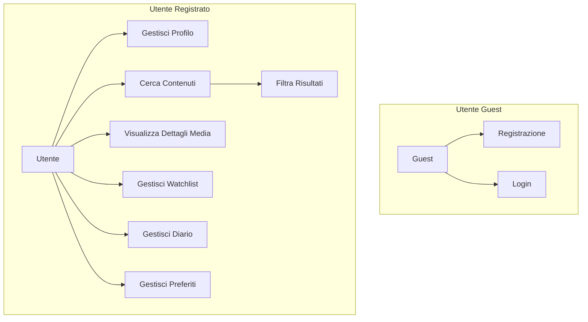
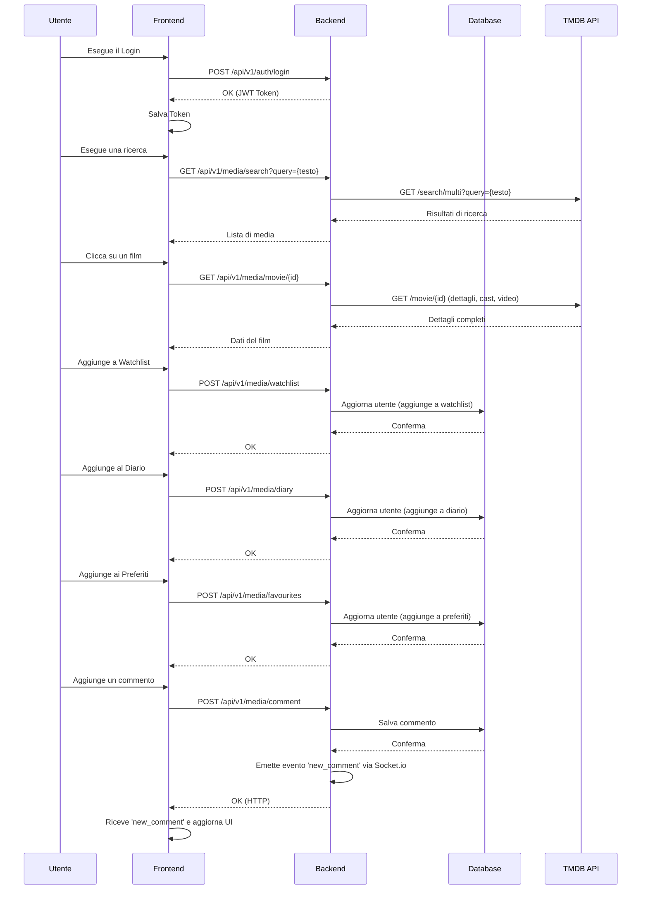
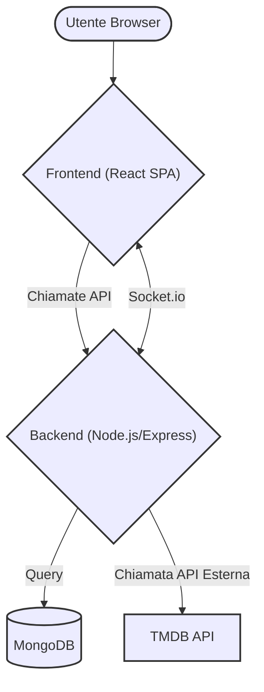

# Relazione del Progetto: LoHobbies

## 1. Scenario Applicativo e Visione del Progetto

### 1.1 Introduzione
LoHobbies è una piattaforma web moderna e interattiva, concepita come un hub centrale per gli amanti del cinema e delle serie televisive. L'obiettivo è superare la semplice catalogazione di contenuti, offrendo un'esperienza utente ricca e personalizzata. L'applicazione permette di scoprire nuovi titoli in linea con i propri gusti, comporre un diario dettagliato delle proprie visioni e condividere le proprie passioni con una community.

### 1.2 Funzionalità Chiave
-   **Scoperta Intelligente**: Oltre a mostrare i titoli di tendenza, LoHobbies fornisce una sezione "Esplora" con filtri avanzati (per genere, anno di uscita, popolarità, valutazione) per aiutare gli utenti a trovare esattamente ciò che cercano.
-   **Gestione delle Liste Personali**:
    -   **Watchlist**: Funge da promemoria per i contenuti che l'utente vuole vedere.
    -   **Diario**: Permette di costruire uno storico delle proprie visioni. Ogni voce può essere arricchita con una valutazione (da 1 a 5 stelle), un commento personale e la data di visione, trasformando il diario in un vero e proprio archivio personale.
    -   **Preferiti**: Una schermata che contiene tutti i nostri titoli preferiti aggiunti cliccando sul bottone a forma di cuore.
-   **Autenticazione Sicura e Profilo Utente**: Il sistema di autenticazione è basato su token (JWT), con meccanismi di refresh automatico per garantire una sessione fluida e sicura. Gli utenti possono personalizzare il proprio profilo con un nome e una foto profilo, nel caso in cui non è presente una foto profilo caricata dall'utente ci sarà un placeholder con la prima lettera maiuscola del nome utente.
-   **Pagine di Dettaglio Complete**: Ogni media (film o serie TV) e persona (attore, regista) ha una pagina dedicata che aggrega tutte le informazioni rilevanti: trama, cast, produzioni correlate, trailer ufficiali (tramite modale) e raccomandazioni basate su algoritmi.
- **Menù impostazioni**: composto da diverse voci che ci permettono di cambiare la lingua dell'applicazione (italiano e inglese), il tema dell'applicazione (white-mode e dark-mode), la possibilità di cambiare password e di aggiornare la foto profilo.

## 2. Architettura dell'Applicazione

L'architettura è basata sul modello a tre livelli (Three-Tier Architecture), che separa la presentazione, la logica applicativa e la gestione dei dati.

-   **Frontend (Livello di Presentazione)**:
    -   **Framework**: React (v19)
    -   **Routing**: `react-router-dom` per la navigazione client-side in una Single Page Application (SPA).
    -   **State Management**: React Context API (`AuthContext`, `FilterContext`, `ThemeContext`) per la gestione dello stato globale (autenticazione, filtri, tema).
    -   **Chiamate API**: `axios` per le comunicazioni HTTP con il backend, con un'istanza pre-configurata e interceptor per la gestione automatica del refresh dei token.
    -   **Styling**: CSS puro con un approccio modulare per componente.

-   **Backend (Livello Logico)**:
    -   **Framework**: Node.js con Express.js per la creazione di un'API RESTful robusta.
    -   **Comunicazione Real-time**: `socket.io` per la gestione dei commenti in tempo reale.
    -   **Gestione Asincrona**: Utilizzo di `async/await` per operazioni non bloccanti, specialmente nelle interazioni con il database e le API esterne.
    -   **Sicurezza**: Middleware `authMiddleware` per proteggere gli endpoint che richiedono autenticazione tramite la verifica di JSON Web Tokens (JWT).
    -   **Integrazione Esterna**: Un modulo dedicato (`tmdb.js`) gestisce tutte le chiamate verso l'API di The Movie Database (TMDB) per l'arricchimento dei dati.

-   **Database (Livello Dati)**:
    -   **Sistema**: MongoDB, un database NoSQL a documenti che offre flessibilità per la gestione dei dati degli utenti.
    -   **ODM**: Mongoose per la modellazione degli oggetti di business (schema `User`) e la gestione delle interazioni con il database.

---

## 3. Diagrammi UML

### 3.1 Diagramma dei Casi d'Uso Esteso

### 3.2 Diagramma di Sequenza (Interazioni Principali)

---

## 4. Modello dei Dati Dettagliato

Il database MongoDB utilizza una singola collection `users` per memorizzare tutte le informazioni.

### Schema `User` (`LoHobbies/backend/models/User.js`)

-   `name`: (String, Required) - Nome visualizzato dell'utente.
-   `email`: (String, Required, Unique) - Identificativo univoco per l'autenticazione.
-   `password`: (String, Required, Select: false) - Hash della password (non restituito di default nelle query).
-   `refreshToken`: (String) - Token utilizzato per rinnovare la sessione senza richiedere un nuovo login.
-   `profilePicture`: (String) - Path dell'immagine del profilo caricata sul server.
-   `watchlist`, `diary`, `favourites`: (Array di Sub-documenti) - Ognuno di questi array contiene oggetti con una struttura definita, che include non solo l'ID del media ma anche metadati come `title` e `posterPath` per ridurre la necessità di chiamate API aggiuntive quando si visualizzano le liste.
    -   **Sottodocumento `diary`**: Include campi aggiuntivi come `rating` (Number), `comment` (String) e `watchedDate` (Date) per una registrazione dettagliata.
-   `timestamps`: (Boolean: true) - Aggiunge automaticamente i campi `createdAt` e `updatedAt` a ogni documento.

---

## 5. Documentazione delle API (Backend)

Descrizione dettagliata degli endpoint principali.

### 5.1 Autenticazione (`/auth`)
-   `POST /register`: Body: `{ name, email, password }`. Crea un nuovo utente.
-   `POST /login`: Body: `{ email, password }`. Autentica l'utente e restituisce `accessToken` e dati utente. Imposta un `httpOnly` cookie con il `refreshToken`.
-   `GET /`: (Protetta) Endpoint usato per verificare la validità del token e caricare i dati dell'utente all'avvio dell'app.
-   `POST /profile-picture`: (Protetta) Accetta `multipart/form-data` per il caricamento di un'immagine.
-   `DELETE /profile-picture`: (Protetta) Rimuove l'immagine del profilo.
-   `POST /verify-password`: (Protetta) Verifica la password corrente.
-   `POST /reset-password`: (Protetta) Reimposta la password.

### 5.2 Media (`/media`)
-   `GET /discover`: Query params: `?genre=28&sort_by=popularity.desc`. Permette una ricerca filtrata.
-   `GET /search`: Query params: `?query=matrix`. Restituisce una lista di film, serie TV e persone.
-   `POST /watchlist`: (Protetta) Body: `{ mediaId, mediaType, title, ... }`. Aggiunge un elemento alla watchlist.
-   `DELETE /watchlist/:mediaId`: (Protetta) Rimuove un elemento specifico dalla watchlist. Logica simile per `diary` e `favourites`.
-   `GET /:mediaType/:mediaId/comments`: Restituisce i commenti per un media specifico.

---

## 6. Componenti React (Frontend)

Analisi della struttura dei componenti e del flusso di dati. 

### 6.1 Flusso dei Dati e Gestione dello Stato
L'applicazione fa un uso estensivo della React Context API per evitare il "prop drilling".
-   **`AuthContext`**: Fornisce a tutti i componenti figli l'oggetto `user`, lo stato `loading` e le funzioni `login`/`logout`. All'avvio, tenta di caricare i dati dell'utente (`loadUser`) per mantenere la sessione.
-   **`FilterContext`**: Mantiene lo stato dei filtri selezionati nel `FilterModal` e li rende disponibili alle pagine `Explore` e `SearchPage` per costruire le query API corrette.
-   **`ThemeContext`**: Permette di cambiare il tema (es. da chiaro a scuro) e applica le classi CSS corrispondenti al `div` principale dell'app.

### 6.2 Descrizione dei Componenti Chiave
-   **`Header.js`**: Componente principale per la navigazione, include la barra di ricerca con suggerimenti live, link alle sezioni principali e un menu utente per l'accesso a watchlist, diario, preferiti e impostazioni.
-   **`Carousel.js`**: Componente versatile per la visualizzazione di media in caroselli orizzontali. Utilizzato per mostrare i titoli di tendenza, i risultati della ricerca e le raccomandazioni.
-   **`AuthModal.js`**: Modale che gestisce sia la registrazione che il login, con validazione dei dati in tempo reale e opzioni per il recupero della password.
-   **`MediaPage.js`**: Pagina di dettaglio per film e serie TV. Carica e visualizza informazioni complete, tra cui trama, cast, trailer e commenti.
-   **`CommentModal.js`**: Permette agli utenti di aggiungere commenti, che vengono poi visualizzati in tempo reale grazie a `socket.io`.
-   **`FilterModal.js`**: Offre opzioni di filtro avanzate per la sezione "Esplora", consentendo agli utenti di affinare la ricerca per genere, anno e popolarità.

---

## 7. Sicurezza e Gestione degli Errori

### 7.1 Misure di Sicurezza
La sicurezza è un aspetto fondamentale dell'applicazione, implementata sia a livello di backend che di frontend.
-   **Autenticazione basata su Token (JWT)**: L'accesso alle risorse protette è controllato tramite JSON Web Tokens. L'Access Token ha una breve durata per minimizzare i rischi in caso di compromissione, mentre il Refresh Token, memorizzato in un cookie `httpOnly` per prevenire attacchi XSS, permette di rinnovare la sessione in modo sicuro.
-   **Hashing delle Password**: Le password degli utenti non vengono mai memorizzate in chiaro. Viene utilizzato l'algoritmo `bcrypt` per creare un hash sicuro della password prima di salvarla nel database.
-   **Protezione degli Endpoint**: Il backend utilizza un middleware (`authMiddleware.js`) che viene applicato a tutte le rotte che richiedono l'autenticazione. Questo middleware verifica la validità del JWT presente nell'header della richiesta.
-   **CORS (Cross-Origin Resource Sharing)**: La configurazione CORS sul backend è restrittiva e permette richieste solo da origini fidate (l'URL del frontend),

 impedendo richieste non autorizzate da altri domini.
-   **Validazione dell'Input**: Viene eseguita una validazione di base sull'input dell'utente per prevenire attacchi comuni.

### 7.2 Gestione degli Errori
-   **Backend**: Il server Express è configurato con un gestore di errori globale (`unhandledRejection`) che cattura qualsiasi errore asincrono non gestito, logga il messaggio e chiude il server in modo controllato per prevenire stati inconsistenti. Le risposte API utilizzano codici di stato HTTP standard (es. 400, 401, 404, 500) per comunicare la natura dell'errore al client.
-   **Frontend**: Il client utilizza gli `interceptor` di Axios per gestire centralmente gli errori delle API. In particolare, l'interceptor di risposta gestisce automaticamente gli errori `401 Unauthorized` tentando di rinnovare il token. Per l'utente finale, gli errori vengono mostrati attraverso notifiche o messaggi contestuali per non interrompere l'esperienza di navigazione.

---

## 8. Diagramma di Architettura Visuale

Questo diagramma illustra il flusso di comunicazione tra i vari componenti del sistema.

---

## 9. Flusso di Dati Dettagliato nel Frontend

Il flusso di dati nel frontend è progettato per essere unidirezionale e prevedibile, seguendo i principi di React.

1.  **Inizializzazione dell'App**:
    -   Al caricamento, `App.js` renderizza i `Provider` dei contesti (`AuthProvider`, `FilterProvider`, `ThemeProvider`).
    -   `AuthProvider` esegue un `useEffect` che chiama la funzione `loadUser`.
    -   `loadUser` effettua una chiamata `GET /api/v1/auth` per recuperare i dati dell'utente se esiste una sessione valida (tramite il refresh token cookie). Il risultato popola lo stato `user` nel contesto.

2.  **Interazione dell'Utente (Esempio: Aggiunta al Diario)**:
    -   L'utente si trova sulla `MediaPage` e clicca sul pulsante per aggiungere un film al diario.
    -   Viene aperta una modale (`DiaryModal`) che permette di inserire valutazione e commento.
    -   Al salvataggio, il componente chiama una funzione (es. `handleAddToDiary`).
    -   Questa funzione invia una richiesta `POST /api/v1/media/diary` al backend tramite Axios, includendo l'ID del media, la valutazione e il commento. Il token di autenticazione viene automaticamente allegato all'header dall'interceptor di Axios.
    -   Il backend processa la richiesta, aggiorna il documento dell'utente nel database e restituisce una risposta di successo.
    -   Il frontend riceve la risposta. A questo punto, può invalidare i dati esistenti per forzare un ri-fetch del diario (`loadUser()` o una funzione specifica) oppure aggiornare lo stato locale per riflettere immediatamente la modifica senza una nuova chiamata API.
    -   Viene mostrata una notifica di successo (`SuccessModal`) all'utente.

Questo approccio garantisce che lo stato dell'interfaccia utente sia sempre sincronizzato con lo stato del backend, fornendo un'esperienza fluida e reattiva.

3.  **Comunicazione Real-time con Socket.io**:
    -   Quando un utente aggiunge un commento, il frontend invia una richiesta `POST` al backend.
    -   Il backend salva il commento nel database e, tramite `socket.io`, notifica a tutti i client connessi che è stato aggiunto un nuovo commento.
    -   Il frontend, in ascolto sull'evento `socket.io`, riceve il nuovo commento e aggiorna dinamicamente l'interfaccia utente senza la necessità di un refresh della pagina.

## 10. Deployment

L'applicazione è deployata su una Virtual Machine (VM) di Google Cloud Platform, seguendo un approccio che separa frontend e backend per garantire scalabilità e manutenibilità.

### 10.1 Configurazione dell'Ambiente
-   **Istanza VM**: È stata creata un'istanza su Google Compute Engine con un sistema operativo Linux (Ubuntu).
-   **Software Requisiti**: Sulla VM sono stati installati Node.js, npm e Nginx.
-   **Database**: Il database MongoDB è ospitato su MongoDB Atlas, un servizio di database gestito che garantisce alta disponibilità e backup automatici.

### 10.2 Deployment del Backend
1.  **Clonazione del Repository**: Il codice sorgente del backend è stato clonato dal repository Git sulla VM.
2.  **Installazione delle Dipendenze**: Le dipendenze sono state installate tramite il comando `npm install`.
3.  **Configurazione delle Variabili d'Ambiente**: È stato creato un file `.env` per configurare le variabili d'ambiente, inclusa la stringa di connessione a MongoDB Atlas e i segreti per JWT.
4.  **Esecuzione con PM2**: Il server Node.js è gestito tramite PM2, un process manager che garantisce che l'applicazione rimanga attiva in modo continuo e si riavvii automaticamente in caso di errori.

### 10.3 Dipendenze Chiave del Backend
Il backend si basa su un ecosistema di pacchetti Node.js per fornire le sue funzionalità:
-   **`express`**: Framework web per la creazione dell'API RESTful.
-   **`mongoose`**: ODM per l'interazione con il database MongoDB.
-   **`bcryptjs`**: Per l'hashing sicuro delle password.
-   **`jsonwebtoken`**: Per la creazione e la verifica dei token JWT.
-   **`cookie-parser`**: Per la gestione dei cookie, utilizzato per il refresh token.
-   **`cors`**: Per abilitare le richieste cross-origin dal frontend.
-   **`dotenv`**: Per la gestione delle variabili d'ambiente.
-   **`multer`**: Per la gestione del caricamento di file (immagini del profilo).
-   **`socket.io`**: Per la comunicazione in tempo reale.

---

## 11. Monitoraggio e Analytics

Per comprendere il comportamento degli utenti e migliorare l'esperienza sulla piattaforma, LoHobbies integra Google Analytics 4 (GA4), una soluzione di analisi di nuova generazione che permette di misurare il traffico e l'engagement su siti web e applicazioni.

### 11.1 Configurazione e Integrazione
-   **Inizializzazione**: Google Analytics è stato integrato nel frontend React tramite il pacchetto `react-ga4`. La configurazione viene inizializzata nel file principale dell'applicazione (`App.js`), utilizzando un Measurement ID univoco fornito da Google.
-   **Tracciamento delle Pagine Viste**: `react-ga4` traccia automaticamente le visualizzazioni di pagina ogni volta che la cronologia di navigazione del browser cambia, grazie all'integrazione con `react-router-dom`. Questo permette di raccogliere dati su quali pagine vengono visitate più frequentemente.

### 11.2 Limiti dell'Integrazione Attuale
L'attuale integrazione di Google Analytics si limita al tracciamento automatico delle pagine viste. Sebbene questo fornisca dati utili sulla popolarità delle diverse sezioni dell'applicazione, non vengono monitorate interazioni specifiche degli utenti come login, registrazioni o aggiunte alle liste personali.

Per ottenere una comprensione più approfondita del comportamento degli utenti, sarebbe necessario implementare eventi personalizzati. Questi eventi permetterebbero di raccogliere dati granulari su quali funzionalità vengono utilizzate più di frequente, aiutando a guidare le future decisioni di sviluppo e a ottimizzare l'esperienza utente.
